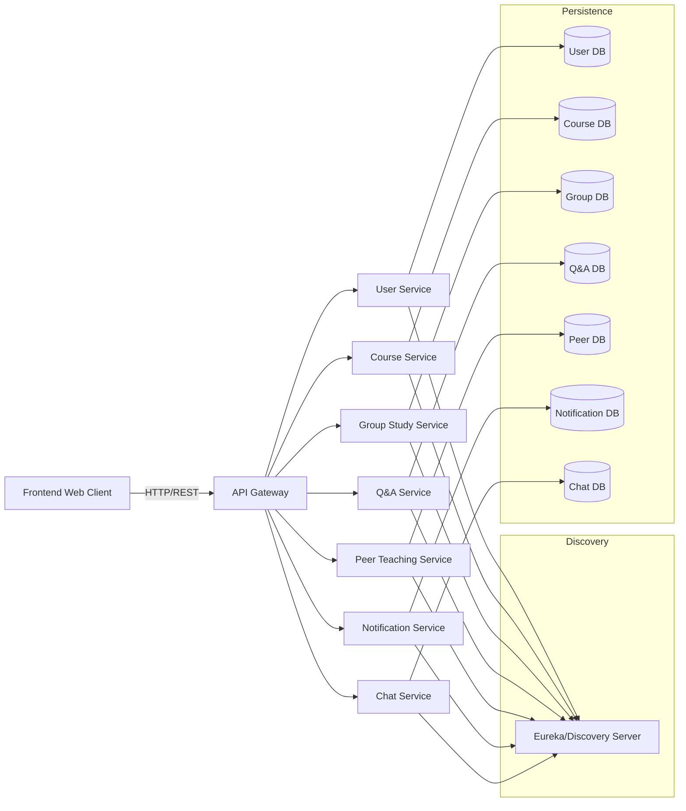

# TogetherLearn Software Architecture & Design

## 1. Purpose
This document defines the software architecture, design decisions, and implementation strategy for TogetherLearn as a distributed system. The goal is to transform the current monolithic application into an architecture that supports:

- a real-world collaborative learning platform for university students
- multiple concurrent users and transactions
- secure access control and role-aware operations
- efficient data storage, retrieval, and analytics
- interaction between independent services
- clear functional and non-functional requirements

## 2. Problem Statement
TogetherLearn addresses the real-world need for students to collaborate on study groups, ask course-related questions, request peer tutoring, and manage curriculum-aligned learning activities. The system must support large student populations, provide reliable scheduling and notifications, and enable rich interaction across content, users, and study services.

## 3. Functional Requirements
The platform must support the following core functions:

1. User registration, authentication, and profile management.
2. Course module listing and curriculum mapping by department and semester.
3. Study group creation, scheduling, joining, and hosting.
4. Group messaging or communication related to study sessions.
5. Question posting, answering, and thread management.
6. Peer teaching request creation, matching, and status tracking.
7. Notification delivery for events such as invites, answers, and requests.
8. File uploads and avatar/profile image handling.
9. Analytics and reporting on usage, participation, and content activity.

## 4. Non-Functional Requirements
To satisfy the target characteristics, TogetherLearn must also support:

- Scalability: Handle many users, sessions, and requests without centralized bottlenecks.
- Availability: Keep services running and responsive during load.
- Security: Enforce authentication, authorization, and input validation.
- Maintainability: Make services independent and evolution-friendly.
- Performance: Efficiently retrieve and store data, and minimize latency.
- Interoperability: Allow communication among services through clear APIs.
- Observability: Enable logging, monitoring, and metrics collection.

## 5. Target Architecture
The recommended architecture is a distributed microservices architecture with the following components:

- API Gateway
- Service Discovery
- Authentication / User Service
- Course Module Service
- Group Study Service
- Q&A Service
- Peer Teaching Service
- Notification Service
- Chat Service
- Frontend Web Client
- Shared API contracts and common utilities

### 5.1 Architectural Style
The design uses a microservices architecture with:

- Domain-driven service boundaries
- API Gateway as the single entry point
- Service Discovery for runtime location of services
- Database-per-service principle
- REST/HTTP for synchronous interactions
- Optional event-driven notifications for asynchronous decoupling

### 5.2 Logical View
The system can be represented at a high level as:



## 6. Service Decomposition

### 6.1 API Gateway
Responsibilities:

- Authenticate requests and forward tokens
- Route requests to appropriate backend services
- Apply rate limiting, logging, and request validation
- Provide a single public endpoint for the frontend

Justification: The gateway centralizes client access and hides service topology. It reduces cross-service complexity for the frontend.

### 6.2 Service Discovery
Responsibilities:

- Maintain service registry of available service instances
- Enable dynamic service lookup for inter-service calls
- Support scaling by registering multiple instances

Justification: Discovery removes hardcoded endpoints and supports elastic scaling. Netflix Eureka is appropriate for a Spring Boot lab project.

### 6.3 User Service
Responsibilities:

- Register, login, and manage user profiles
- Issue JWT tokens
- Validate user roles and access control
- Provide user identity data for other services

Justification: Authentication and user data is a core bounded context. Isolating it makes security easier and supports future identity federation.

### 6.4 Course Module Service
Responsibilities:

- Store course module catalog and curriculum metadata
- Provide course lookups by department, semester, or code
- Seed academic curriculum data

Justification: Course information is stable and reusable across study groups, questions, and peer teaching.

### 6.5 Group Study Service
Responsibilities:

- Create and manage study groups
- Track participants, hosts, schedule, and location
- Enforce group membership rules and course association

Justification: Study group coordination is a distinct workflow that benefits from independent scaling.

### 6.6 Q&A Service
Responsibilities:

- Handle question posting, replies, and voting/feedback
- Support question search and filtering by course
- Provide question lifecycle status

Justification: The Q&A domain has its own data model and content lifecycle.

### 6.7 Peer Teaching Service
Responsibilities:

- Manage tutoring requests and offers
- Track request lifecycle and match status
- Maintain tutor/learner relationships

Justification: Peer teaching is a distinct collaboration scenario with its own workflows.

### 6.8 Notification Service
Responsibilities:

- Deliver alerts for invites, replies, request updates, and system events
- Store notification history per user
- Support push/pull notification retrieval

Justification: Notifications crosscut many domains and should be centralized to avoid duplicate logic.

### 6.9 Chat Service
Responsibilities:

- Manage group chat messages for study sessions
- Persist messages and support retrieval
- Optionally support real-time WebSocket connections

Justification: Chat is a performance-sensitive feature and benefits from isolation for scaling and availability.

## 7. Data Storage Strategy

The migration emphasises database-per-service using independent stores:

- User Service: H2 / PostgreSQL for user accounts
- Course Service: H2 / PostgreSQL for curriculum data
- Group Study Service: H2 / PostgreSQL for study session metadata
- Q&A Service: H2 / PostgreSQL for questions and answers
- Peer Teaching Service: H2 / PostgreSQL for tutoring requests
- Notification Service: H2 / PostgreSQL for notification events
- Chat Service: H2 / PostgreSQL for chat message persistence

Rationale: Isolated data stores reduce coupling, support service ownership, and simplify horizontal scaling. For the academic migration project, H2 in-memory databases are acceptable and allow fast prototyping.

## 8. Interaction and Integration Patterns

### 8.1 Client-to-Service
- Frontend calls API Gateway via HTTP REST.
- Tokens are included in `Authorization: Bearer <jwt>`.
- Responses are JSON.

### 8.2 Service-to-Service
- Synchronous REST calls via the gateway or direct service discovery.
- Example: Group Study Service may call User Service to validate participant identity.

### 8.3 Asynchronous Patterns
- Use Notification Service events for user notification delivery.
- If advanced, add an event bus (Kafka/RabbitMQ) for `UserCreated`, `GroupJoined`, `QuestionAnswered`, `PeerRequestUpdated`.

Rationale: Synchronous HTTP is simpler for the initial migration. Asynchronous messaging is a future enhancement to improve decoupling and resilience.

## 9. Security and Access Control

### 9.1 Authentication
- JWT-based authentication issued by User Service.
- API Gateway validates tokens and forwards user identity.

### 9.2 Authorization
- Role-based access control for normal users and admins.
- Protect endpoints by ownership and context:
  - Only group hosts can edit or close groups.
  - Only question authors or moderators can modify posts.
  - Only request owners can update peer teaching requests.

### 9.3 Data Protection
- Validate every request with Zod / JSR-303 rules.
- Enforce CORS policies at the gateway layer.
- Sanitize user input and avoid direct object exposure.

### 9.4 Service Hardening
- Use HTTPS in production.
- Protect service discovery endpoints from public exposure.
- Add API rate limiting for public-facing endpoints.

## 10. Analytics and Reporting

The platform should provide analytical support in two forms:

- Usage metrics: active users, group creation rate, question volume, peer request conversions.
- Operational reporting: login trends, notification delivery rates, average response times.

Approach:
- Collect metrics using Prometheus-compatible endpoints or Spring Boot Actuator.
- Store key reports in the Notification Service or a lightweight Reporting Service if needed.
- Expose summary dashboards in the frontend or as exported CSV/JSON.

## 11. Architectural Representations

### 11.1 Component Diagram

```mermaid
flowchart TB
  F[Frontend App] -->|REST| GW[API Gateway]
  GW --> US[User Service]
  GW --> CS[Course Service]
  GW --> GS[Group Study Service]
  GW --> QA[Q&A Service]
  GW --> PT[Peer Teaching Service]
  GW --> NS[Notification Service]
  GW --> CH[Chat Service]
  subgraph Discover[Discovery]
    EV[Eureka]
  end
  EV <-- US
  EV <-- CS
  EV <-- GS
  EV <-- QA
  EV <-- PT
  EV <-- NS
  EV <-- CH
```

### 11.2 Data Flow Example

1. User logs in via frontend.
2. Gateway forwards credentials to User Service.
3. User Service issues JWT.
4. Frontend calls Group Study Service through Gateway.
5. Group Study Service validates user identity with User Service or JWT claims.
6. Group Study Service stores group metadata in its own database.
7. Notification Service sends an invite notification to participants.

## 12. Technical Stack

### Recommended stack for the migration project

- Backend: Spring Boot
- Service discovery: Netflix Eureka
- API Gateway: Spring Cloud Gateway or Zuul
- Inter-service communication: OpenFeign / RestTemplate
- Databases: H2 in-memory for prototyping, PostgreSQL for production
- Security: Spring Security with JWT
- Validation: Spring Boot validation / JSR-303
- Messaging (optional): RabbitMQ or Kafka for asynchronous events
- Frontend: Existing Next.js application on React 19
- Dev tools: Docker for local service orchestration; Maven or Gradle

### Good fit rationale
- Spring Boot fits the migration target and supports microservices patterns.
- Netflix Eureka is common in academic distributed system projects.
- H2 is easy for isolated service DBs and demo environments.
- Next.js remains the client and interfaces cleanly with the gateway.

## 13. Design Decisions and Trade-offs

### Decision: Microservices over monolith
- Pros:
  - Better scalability and independent deployment
  - Clear domain ownership
  - Easier to reason about bounded contexts
- Cons:
  - Increased complexity in service coordination
  - Harder debugging and cross-service transactions
  - Higher operational overhead

### Decision: API Gateway + Service Discovery
- Pros:
  - Centralized routing and security enforcement
  - No hardcoded service addresses
- Cons:
  - Single point of failure if not replicated
  - Additional latency at the gateway

### Decision: Database-per-service
- Pros:
  - Avoids data coupling and schema sharing
  - Enables service autonomy
- Cons:
  - Distributed transactions are harder
  - Need data duplication or synchronization patterns

### Decision: HTTP REST first, asynchronous later
- Pros:
  - Easier implementation and testing
  - Better for request/response flows like posting questions
- Cons:
  - Less resilient than event-driven architectures for notification delivery

## 14. Risks, Assumptions, and Limitations

### Risks
- Service discovery and dynamic routing may introduce deployment complexity.
- Multiple H2 services can hide data consistency problems in production.
- JWT misuse may allow unauthorized access if tokens are not validated correctly.
- Separate databases can lead to stale or duplicated data across services.

### Assumptions
- The application is intended for university student collaboration and carries no heavy enterprise SLAs.
- The existing monolith is sufficient to provide the business capabilities and can be decomposed cleanly.
- The team has Spring Boot experience or can follow guided templates.
- Real-time chat may be implemented later with WebSockets if needed.

### Limitations
- The initial API Gateway design may not support full event-driven scaling.
- H2 in-memory persistence is not durable and is intended for prototypes and academic demonstration.
- Analytics are lightweight and not a full BI solution.

## 15. Migration Roadmap

### Phase 1: Foundation
- Create Eureka discovery service.
- Create API Gateway and register it as a client.
- Convert backend auth and user APIs to Spring Boot.

### Phase 2: Service extraction
- Implement Course Service and data seeding.
- Implement Group Study Service, Q&A Service, Peer Teaching Service.
- Implement Notification Service.
- Implement Chat Service optionally.

### Phase 3: Integration
- Configure gateway routing to all services.
- Validate service discovery and health endpoints.
- Update frontend to target the gateway endpoint.

### Phase 4: Validation and architecture review
- Test functional flows end to end.
- Add logging and metrics.
- Document service contracts and API definitions.

## 16. Conclusion
This architecture document proposes a distributed, scalable, and secure design for TogetherLearn. It aligns with the requirements of handling multiple users, supporting core domain capabilities, enabling cross-service interaction, and supporting future analytics. The proposed stack and decomposition balance prototype feasibility with architectural rigor and support the target academic migration to a Spring Boot microservices architecture.
